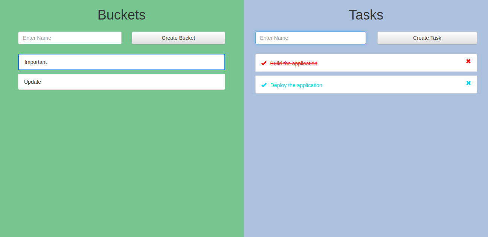
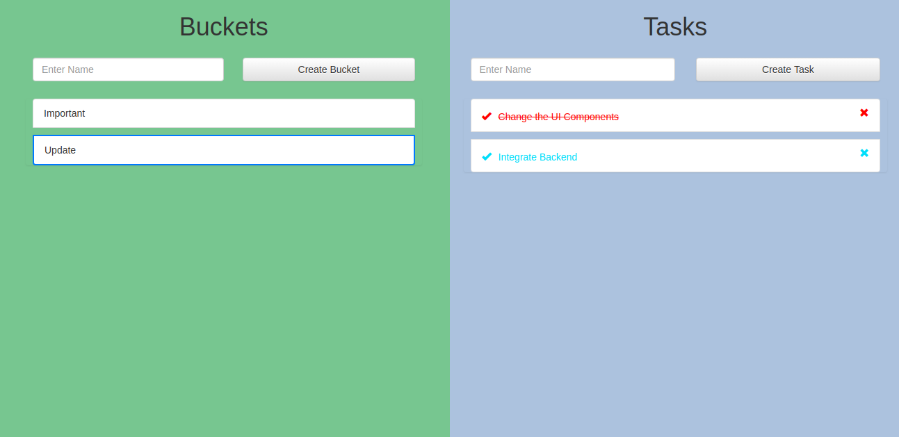

# Todo List Assignment

## This project is an exercise to do the following actions:

	1. User can create, delete a to-do.
	2. They should also be able to mark a to-do done and vice-versa.
	3. They should be able to create a to-do under a bucket. The user has the
	   flexibility to name this bucket according to his/her choice.
		a. All the existing buckets the user has created should be given as
		   options, next time the user tries to create a new bucket.

## Steps to run the project
	
	1. Enter the project directory
	2. Run `npm install`
	3. Run `npm start`

## Link to run the deployed project
	
	[a link](https://paraswadhwa.github.io/todo-app/)

## Available Scripts

In the project directory, you can run:

### `npm start`

Runs the app in the development mode.\
Open [http://localhost:3000](http://localhost:3000) to view it in the browser.

### `npm run build`

Builds the app for production to the `build` folder.\
It correctly bundles React in production mode and optimizes the build for the best performance.

The build is minified and the filenames include the hashes.

# Screenshots

Important Page:

Update Bucket:

